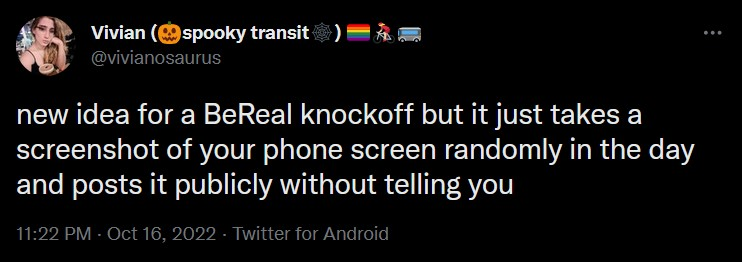

# too-real

Inspired by



### Run

```
pip install -r requirements.txt
```

### Terminal 1

```
python app.py
```

Click on `"Start taking screenshots!"`

### Terminal 2

```
python web.py
```

Navigate to `localhost:5000`
